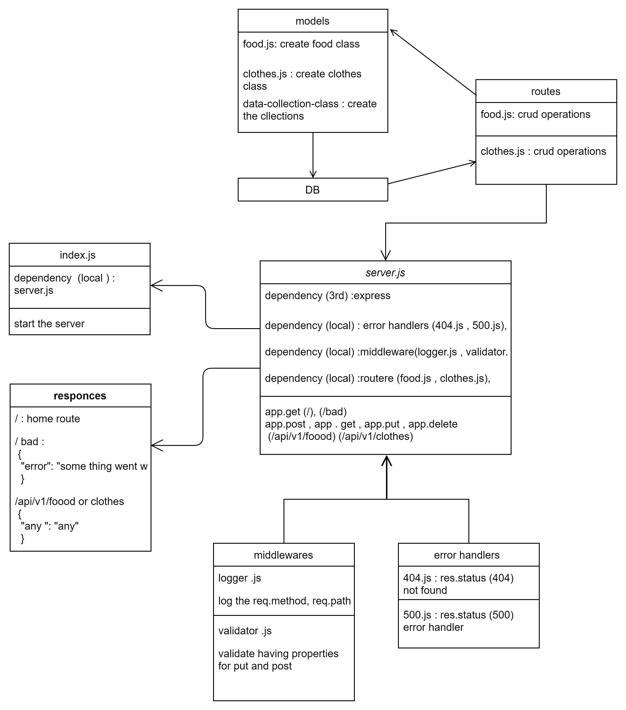

# api-serverSQL

# basic-api-server

this project is a practice prioject for lab 02 of 401 course at asac

- **Author** : hiba salem

- ### description

Dynamic API server to practice standards compliant Express server
Dynamic API Phase 3: Add Persistence (Database) to your API

---

- ### NML



[NML](https://drive.google.com/file/d/1xFnXqAxvzYhNYf09JsOBLloL1n0ttqU4/view?usp=sharing)

---

- ### [PR](https://github.com/hibasalem/api-serverSQL/pull/1)

---

- ### deploy links

  - [main deployment](https://api-serverSQLmain.herokuapp.com)

  - [tests report](https://github.com/hibasalem/api-serverSQL/actions)

---

- ### getting this app

  - clone and npm i --production.
  - npm start or nodemon

---

- ### Setup

  - `.env requirements`
  - `PORT` - Port Number

---

- ### end points

  - `/api/v2/clothes` or `/api/v2/clothes`
  - get

  ```
    [
        {
            "id": "819a8ef6-ceee-4252-bfab-6de4a94a3c1a",
            "data": {
                "any": "any"
            }
        }
    ]

  ```

  - `/api/v2/clothes/${id}` or `/api/v2/clothes/${id}`
  - get

  ```
        {
            "id": "${id}",
            "data": {
                "test2": "test"
            }
        }

  ```

  - `/api/v2/clothes` or `/api/v2/clothes`
  - post
  - send in the body `{"any": "any"}`

  ```
    {
        "id": "any",
        "data": {
            "any": "any"
        }
    }

  ```

  - `/api/v2/clothes${id}` or `/api/v2/clothes${id}`
  - put
  - send in the body `{"any": "any"}`

  ```
    {
        "id": "${id}",
        "data": {
            "any": "any"
        }
    }

  ```

  - `/api/v2/clothes${id}` or `/api/v2/clothes${id}`
  - delete

  ```
  "undefind"

  ```

  - `/`

  ```

  {
  home route
  }

  ```

  - `/bad`

  ```

  {
  "error": "some thing went wrong"
  }

  ```

---

- ### test this app

  - clone and npm i -D.
  - npm test

---

- ## tests

  - response with 404 on a bad route
  - response with 404 on a bad method
  - Create a record using POST
  - Read a list of records using GET
  - Read a record using GET
  - Update a record using PUT
  - Destroy a record using DELETE
