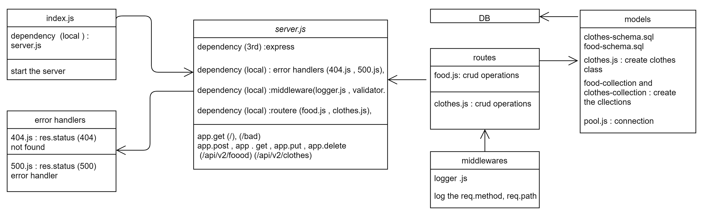

# api-serverSQL

# basic-api-server

this project is a practice prioject for lab 09 of 401 course at asac

- **Author** : hiba salem


---

- ### NML



[NML](https://drive.google.com/file/d/1xFnXqAxvzYhNYf09JsOBLloL1n0ttqU4/view?usp=sharing)

---

- ### [PR 1 ](https://github.com/hibasalem/api-serverSQL/pull/1)
- ### [PR 2 ](https://github.com/hibasalem/api-serverSQL/pull/2)


---

- ### deploy links

  - [main deployment](https://api-serversql.herokuapp.com/)

  - [tests report](https://github.com/hibasalem/api-serverSQL/actions)

---

- ### getting this app

  - clone and npm i --production.
  - npm start or nodemon

---

- ### Setup

  - `.env requirements`
  - `PORT` - Port Number
  - `DATABASE_URL` 

---

- ### end points

  - `/api/v2/clothes` or `/api/v2/clothes`
  - get

  ```
    [
        {
            "id": 1,
            "name": "any",
            "ingridents": "any",
            "caluries": number
        }
    ]

  ```
  
  or 
  ```
    [
        {
            "id": 1,
            "type": "any",
            "session": "any",
            "price": number,
            "avilable": true/false
        }
    ]

  ```

  - `/api/v2/clothes/${id}` or `/api/v2/clothes/${id}`
  - get

  ```
        {
            "id": ${id},
            "name": "any",
            "ingridents": "any",
            "caluries": number
        }

  ```
  or 
  
  ```
          {
            "id": ${id},
            "type": "any",
            "session": "any",
            "price": number,
            "avilable": true/false
        }
  ```


  - `/api/v2/clothes` or `/api/v2/clothes`
  - post
  - send in the body `         {
            "name": "any",
            "ingridents": "any",
            "caluries": number
        }`     or `          {
            "type": "any",
            "session": "any",
            "price": number,
            "avilable": true/false
        }`

  ```
        {
            "id": 1,
            "name": "any",
            "ingridents": "any",
            "caluries": number
        }

  ```
  
  or 
  ```
  
            {
            "id": 1,
            "type": "any",
            "session": "any",
            "price": number,
            "avilable": true/false
        }
  
  ```

  - `/api/v2/clothes${id}` or `/api/v2/clothes${id}`
   - put
  - send in the body `         {
            "id": ${id},
            "name": "any",
            "ingridents": "any",
            "caluries": number
        }`     or `          {
            "id": ${id},
            "type": "any",
            "session": "any",
            "price": number,
            "avilable": true/false
        }`

  ```
        {
            "id": ${id},
            "name": "any",
            "ingridents": "any",
            "caluries": number
        }
  ```
  
  or 
  ```            {
            "id": ${id},
            "type": "any",
            "session": "any",
            "price": number,
            "avilable": true/false
        }
  ```

  - `/api/v2/clothes${id}` or `/api/v2/clothes${id}`
  - delete

  ```
        {
            "id": ${id},
            "name": "any",
            "ingridents": "any",
            "caluries": number
        }
  ```
  
  or 
  ```            {
            "id": ${id},
            "type": "any",
            "session": "any",
            "price": number,
            "avilable": true/false
        }
  ```

  - `/`

  ```
  home route
  
  ```

  - `/foo`

  ```

  {
  "error": "404 not found"
  }

  ```

---

- ### test this app

  - clone and npm i -D.
  - npm test

---
